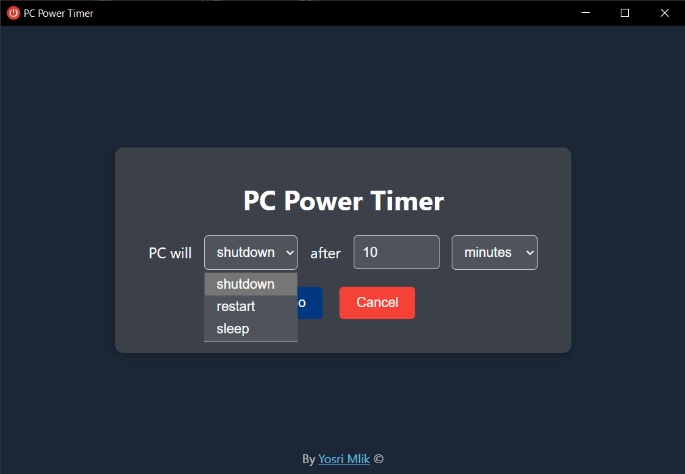
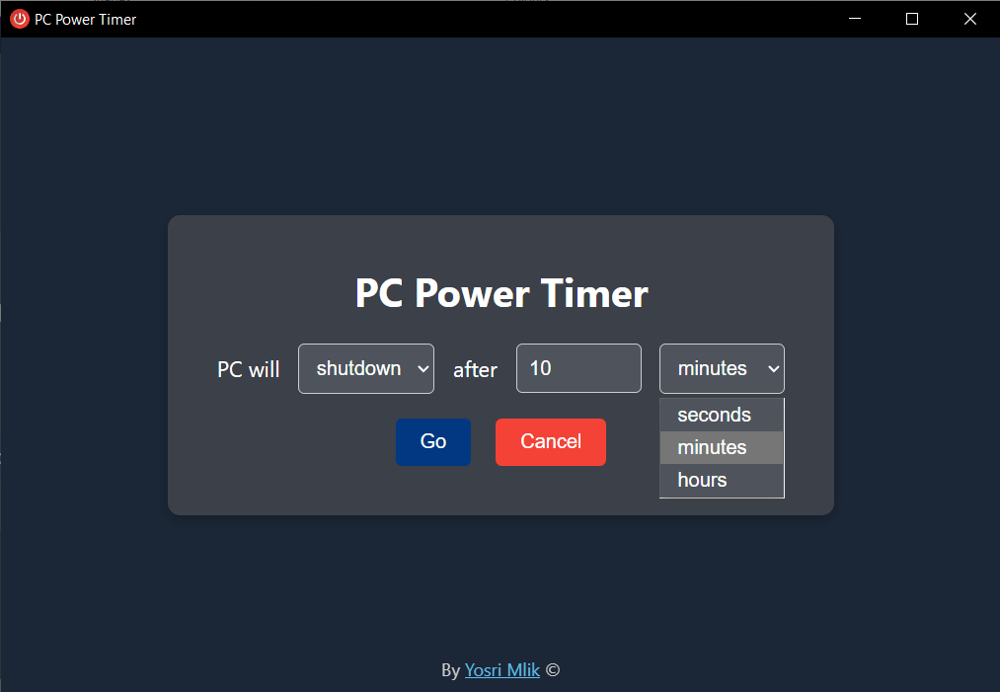

# PC Power Timer

Schedule your PC's power actions with ease - automatically shut down, restart, or put your computer to sleep after a set duration. Perfect for managing long-running tasks, downloads, or saving energy when you step away.

## Features

- **Schedule Power Actions**: Set timers for shutdown, restart, or sleep
- **Flexible Time Units**: Choose between seconds, minutes, or hours
- **Easy Cancellation**: Cancel any running timer with a single click
- **Simple Interface**: Clean and intuitive user interface
- **Windows Native**: Built specifically for Windows systems

## Screenshots




## Prerequisites

- **Go** (version 1.18 or higher)
- **Node.js** (version 16 or higher)
- **npm** (comes with Node.js)
- **Wails CLI**: Install with `go install github.com/wailsapp/wails/v2/cmd/wails@latest`

## Installation

1. Clone the repository:
   ```bash
   git clone https://github.com/YosriMlik/pc-power-timer.git
   cd pc-power-timer
   ```

2. Install frontend dependencies:
   ```bash
   cd frontend
   npm install
   cd ..
   ```

3. Install Go dependencies:
   ```bash
   go mod download
   ```

## Development

To run the application in development mode with hot-reload:

```bash
wails dev
```

This will:
- Start a Vite development server for the frontend
- Compile and run the Go backend
- Enable hot-reload for both frontend and backend changes
- Provide a dev server at http://localhost:34115 for browser testing

## Building

To build a redistributable production package:

```bash
wails build
```

The built executable will be in the `build` directory.

## Usage

1. Launch the application
2. Select the desired power action (Shutdown, Restart, or Sleep)
3. Set the duration and time unit (seconds, minutes, or hours)
4. Click "Start Timer" to begin
5. Cancel the timer anytime if needed

## Project Structure

```
PC Power Timer/
├── app.go           # Main application logic and timer functions
├── main.go          # Wails application entry point
├── wails.json       # Wails project configuration
├── frontend/        # React frontend application
│   ├── src/         # Source files
│   └── dist/        # Built frontend files
└── build/           # Compiled executables
```

## Technical Details

- **Backend**: Go with Wails v2
- **Frontend**: React with Vite
- **Platform**: Windows
- **Power Commands**:
  - Shutdown: `shutdown /s /t 0`
  - Restart: `shutdown /r /t 0`
  - Sleep: `rundll32.exe powrprof.dll,SetSuspendState 0,1,0`


## Releases

Download the latest executable from the [GitHub Releases page](https://github.com/YosriMlik/pc-power-timer/releases/tag/1.0).

## License

This project is open source and available under the MIT License.
